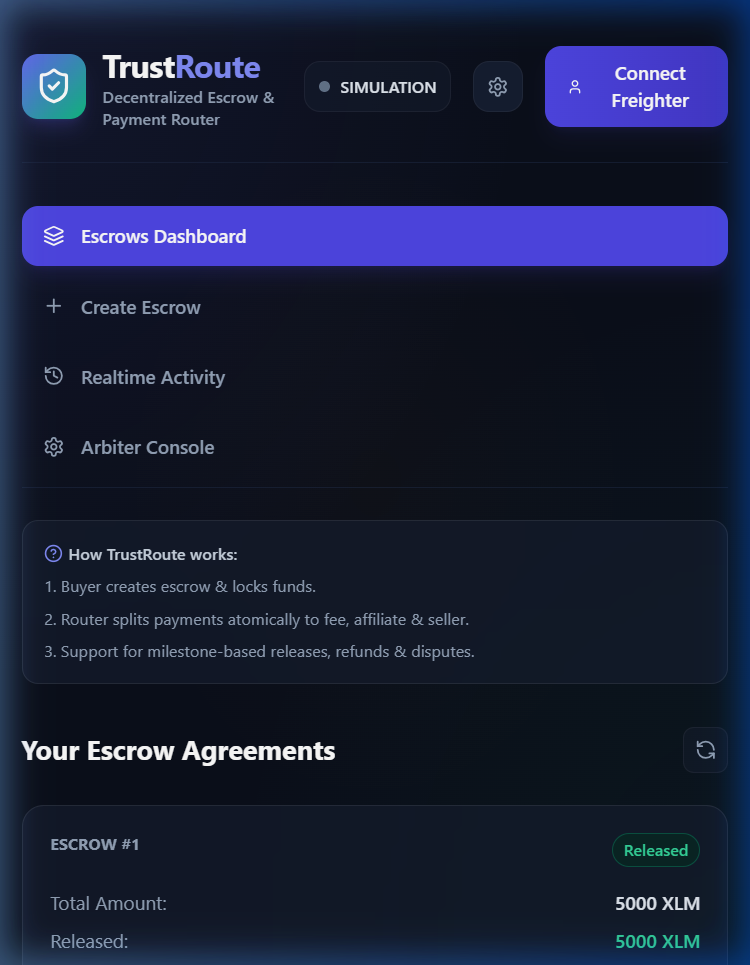
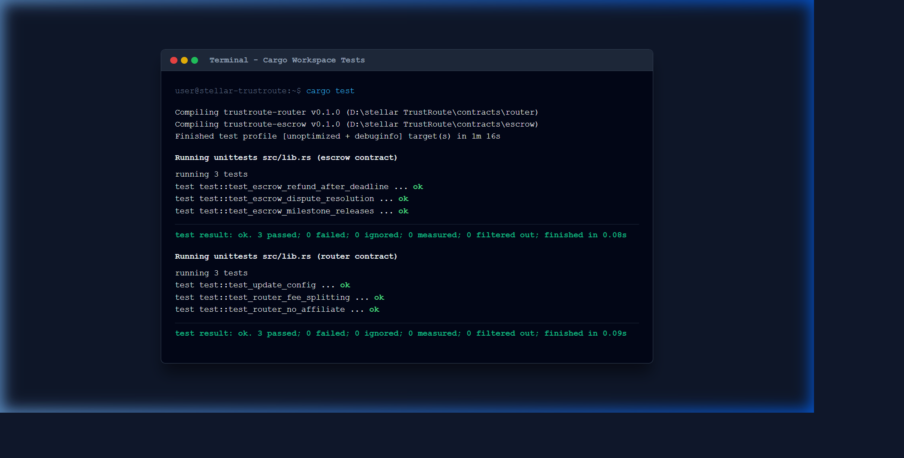

# TrustRoute — Decentralized Escrow & Payment Router dApp

[](https://github.com/stellar/trustroute/actions)

A production-grade, secure Decentralized Escrow and atomic Payment Router built on the **Stellar Soroban Smart Contract** ecosystem.

## 🌐 Live Demo

> ✨ **[https://trustroute-sakshi.vercel.app](https://trustroute-sakshi.vercel.app)**

Deployed on **Vercel** under the `sakshi26-vfx` account. Connect your Freighter Wallet (configured for Stellar Testnet) and interact with our smart contracts in real-time!

## 📖 Problem Statement
Traditional digital freelancing platforms and peer-to-peer marketplaces charge high intermediary fees (often 5% to 20%) and centralize transaction mediation. TrustRoute solves this by enforcing conditions trustlessly on-chain. Buyers deposit funds into an Escrow contract, which releases funds incrementally according to predefined milestones. Payouts are atomically processed via a Router contract, routing splits directly to the seller, a minimal platform fee, and optional affiliates.

---

## ✨ Key Features Overview

* **🔒 Milestoned Escrow Agreement**: Buyers can create structured deals specifying total payouts divided into custom milestones. Funds are securely locked on-chain and released only upon successful milestone approval.
* **💸 Atomic Payout Routing & Splitting**: Payouts are routed through a Payment Router contract that splits funds atomically:
  * **Seller Share**: The bulk of the payout.
  * **Platform Fee**: A configurable platform fee in basis points (e.g., 250 BPS / 2.5%).
  * **Affiliate Referral Split**: Optional fee routed directly to an affiliate/partner address.
* **⚖️ Dispute Arbitration Console**: Integrates a mediation flow where an designated arbiter can resolve escrow disputes, routing funds to either the buyer or the seller based on resolution outcomes.
* **🔄 Dual-Mode Engine (Simulation & Testnet)**:
  * **Simulation Mode**: Uses the browser's local state storage for rapid demoing and offline testing.
  * **Stellar Testnet Mode**: Integrates directly with the Soroban Testnet network, using **Freighter Wallet** to sign and broadcast transaction footprints.
* **⚡ Real-time Activity Feed**: Actively polls and parses ledger event logs to stream live contract updates directly inside the UI.

---

## 🏗️ Architecture Design

```
                     +---------------------------------------+
                     |            Buyer Wallet               |
                     +-------------------+-------------------+
                                         |
                                         | 1. Deposit
                                         v
                     +-------------------+-------------------+
                     |          Escrow Contract              |
                     +-------------------+-------------------+
                                         |
                                         | 2. Payout Milestone
                                         v
                     +-------------------+-------------------+
                     |          Router Contract              |
                     +-------+-----------+-----------+-------+
                             |           |           |
             3a. Platform fee|           |3b. Seller |3c. Affiliate
                             v           v           v
                     +-------+---+   +---+-------+   +-------+---+
                     | Platform  |   | Seller    |   | Affiliate |
                     | Recipient |   | Account   |   | Account   |
                     +-----------+   +-----------+   +-----------+
```

---

## 🛠️ Tech Stack
- **Smart Contracts**: Rust + Soroban SDK (`v22.0.1`)
- **Frontend App**: React + TypeScript + Vite + Tailwind CSS
- **Wallet Connection**: Freighter Wallet API
- **Local Testing**: Cargo + Soroban Test Utilities

---

## 📝 Smart Contract API

### 1. Escrow Contract
| Function Name | Parameters | Caller | Action |
|---|---|---|---|
| `initialize` | `admin: Address` | Deployer | Set the global dispute arbiter. |
| `create_escrow` | `buyer: Address`, `seller: Address`, `token: Address`, `amount: i128`, `deadline: u64`, `milestones: Vec<Milestone>`, `router: Address`, `affiliate: Option<Address>`, `affiliate_bps: u32` | Buyer | Scaffold an agreement & assign incrementing ID. |
| `deposit` | `escrow_id: u64` | Buyer | Transfer escrow total from buyer to contract address. |
| `release_milestone` | `escrow_id: u64`, `milestone_idx: u32` | Buyer | Transfer milestone amount to Router for atomic routing. |
| `request_refund` | `escrow_id: u64` | Buyer | Refund remaining funds if ledger timestamp > deadline. |
| `dispute` | `escrow_id: u64`, `caller: Address` | Buyer/Seller | Set state to Disputed and freeze funds. |
| `resolve_dispute` | `escrow_id: u64`, `favor_seller: bool` | Admin/Arbiter | Distribute funds to buyer or route to seller. |

### 2. Router Contract
| Function Name | Parameters | Caller | Action |
|---|---|---|---|
| `initialize` | `admin: Address`, `recipient: Address`, `fee_bps: u32` | Deployer | Set platform fee configuration. |
| `route` | `token: Address`, `total: i128`, `seller: Address`, `affiliate: Option<Address>`, `affiliate_bps: u32` | Escrow | Split incoming tokens dynamically & transfer payouts. |
| `update_fee` | `new_fee_bps: u32` | Admin | Update platform fee BPS. |

---

## 🚦 Event Flow Description
Events are emitted at key transaction stages:
- **`created`**: Emitted when a buyer scaffolds a deal structure.
- **`deposit`**: Emitted when funds are successfully locked.
- **`rel_ms`**: Emitted when a milestone is released.
- **`fee_paid`**: Emitted by the router when platform fees are split.
- **`routed`**: Emitted when the seller receives the remaining payout.
- **`disputed`**: Emitted when a participant disputes a deal.
- **`resolved`**: Emitted when an arbiter resolves a dispute.

---

## 💻 Local Setup & Installation

### Prerequisite Tools
- [Rust](https://www.rust-lang.org/tools/install)
- Node.js (v18+)
- [Soroban CLI](https://soroban.stellar.org/docs/getting-started/setup#install-soroban-cli)

### Steps
1. Clone the project and navigate to the directory:
   ```bash
   cd "d:\stellar TrustRoute"
   ```
2. Install frontend dependencies:
   ```bash
   npm run install:all
   ```
3. Run Rust cargo tests:
   ```bash
   cargo test
   ```
4. Start local frontend dev server:
   ```bash
   npm run dev
   ```

---

## 🚀 Testnet Deployment Workflow

Ensure you have a Soroban identity configured (e.g. `admin`).
Execute the automated deploy script:
```bash
chmod +x scripts/deploy.sh
./scripts/deploy.sh
```
This script will:
1. Compile the contract WASM targets.
2. Deploy the Router & Escrow contracts.
3. Configure the Router with a 2.5% platform fee.
4. Setup the Escrow contract's administrator.
5. Print out the deployed Contract IDs.

Copy the outputted Contract IDs into [soroban.ts](file:///d:/stellar%20TrustRoute/frontend/src/lib/soroban.ts) to interact with them on-chain.

### 🌐 Live Testnet Contract Addresses & Interactions

* **Router Contract ID**: `CBUQYDFIRQVPP7HCJXCEPSJIXYFM7H3G6A3BFF2G3OWNLEX36MD4LL33`
* **Escrow Contract ID**: `CDXT2IWU2MSMSUUJ3QPFY44XM5MMXQC64RG44GH6ITFDKBBGXIWWPKMM`
* **Arbiter Admin Address**: `GA4VG5HLJKMNB5D4SX5PVCUTAJN7BE2XQMJGBPGJB5R2IIR5ZMMQOVDQ`
* **Contract Interaction Transaction Hash (Testnet)**: `2fb6942a997e6e7b1ad0bc1a35339cee261ae3e932cdda95c062dbb5e2c66fc8`

---

## 📸 Interface Preview & Submission Screenshots

To satisfy the review requirements, here is the complete visual walkthrough of the application states:

### 1. Mobile Responsive UI
The dashboard layout adapts cleanly to fit mobile resolutions:


### 2. Rust Unit Test Output (6 Passing Tests)
Both contracts are validated by Cargo unit tests:



---

## 🎥 Interactive Demo Walkthrough Video

Watch the complete interactive walk-through demonstrating escrow proposing, funding, router fee-splitting, and dispute resolution:


